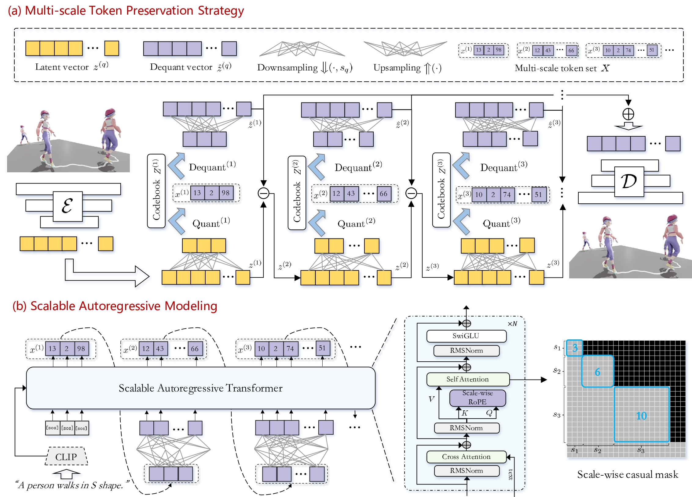

<div align="center">

# MoSa: Motion Generation with Scalable Autoregressive Modeling

**[📄 Paper](https://arxiv.org/abs/2511.01200)** | **[🌐 Project Page](https://eanson023.github.io/MoSa)** | **[🤗 Demo](https://huggingface.co/spaces/MoSa-web/MoSa)**



</div>

---

## 📖 Overview

MoSa is a hierarchical motion generation framework that revolutionizes text-driven 3D human motion synthesis through scalable autoregressive modeling. By introducing **Multi-scale Token Preservation Strategy (MTPS)** within a hierarchical RQ-VAE architecture, MoSa enables efficient coarse-to-fine generation that predicts entire scale tokens at each step—not just single tokens. Our **CAQ-VAE** (Convolution-Attention hybrid VQ-VAE) further enhances reconstruction quality by capturing global dependencies while maintaining lightweight efficiency.

**✨ Highlights:**
- 🚀 **27% faster** inference with only **10 generation steps**
- 🎯 **State-of-the-art quality**: FID **0.06** on Motion-X (vs. MoMask's 0.20)
- ✂️ **Zero-shot motion editing** without additional training
- 🔄 Scalable architecture applicable to multiple datasets

---

## 🚀 Getting Started

### 🛠️ Environment Setup

**Step 1:** Install FFmpeg (required for visualization)
```bash
# Windows
choco install ffmpeg

# Linux
sudo apt-get update && sudo apt-get install ffmpeg
```

**Step 2:** Setup Python environment
```bash
conda create -y -n mosa python=3.10
conda activate mosa
pip install -r requirements.txt
python -m spacy download en_core_web_sm
```

### 📦 Download Pretrained Models

Run the following script to download all necessary models:

```bash
bash prepare/download_evaluator_and_models.sh
```

This downloads:
- ✅ Evaluation models (HumanML3D & Motion-X)
- ✅ Pretrained tokenizer (CAQ-VAE)
- ✅ Pretrained generator (SAR Transformer)

### 💾 Dataset Preparation

<details>
<summary><b>HumanML3D</b></summary>

1. Follow [HumanML3D instructions](https://github.com/EricGuo5513/HumanML3D) to download the dataset
2. Create a symbolic link:
```bash
# Linux/Mac
ln -s /path/to/HumanML3D ./dataset/HumanML3D

# Windows (Administrator required)
mklink /D ".\dataset\HumanML3D" "C:\path\to\HumanML3D"
```
</details>

<details>
<summary><b>Motion-X</b></summary>

1. Download from [Motion-X repository](https://github.com/IDEA-Research/Motion-X)
2. Convert data representation using [HumanTOMATO](https://github.com/IDEA-Research/HumanTOMATO/tree/main/src/tomato_represenation)
3. Place the processed data in `./dataset/` folder
</details>

---

## 💻 Usage

### 🎮 Interactive Demo

Launch the Gradio web interface:
```bash
python app.py
```

### ✍️ Text-to-Motion Generation

Generate motions from text descriptions:

```bash
# HumanML3D
python demo.py --name t2m_pkeep_rope_ffsize768_bs64_milestone100_200 --text_prompt "a person walks in a circle." --repeat_times 10 --motion_length 196 --gpu_id 0 --dataset_name t2m

# Motion-X
python demo.py --name t2m_pkeep_rope_ffsize768_bs64_milestone100_200 --text_prompt "a person walks in a circle." --repeat_times 10 --motion_length 196 --gpu_id 0 --dataset_name motionx
```

<details>
<summary><b>Parameter Guide</b></summary>

| Parameter | Description | Default |
|-----------|-------------|---------|
| `--text_prompt` | Text description of the motion | Required |
| `--motion_length` | Length in frames | 196 |
| `--repeat_times` | Number of samples | 10 |
| `--cond_scale` | CFG guidance scale | 2.0 |
| `--top_k`, `--top_p` | Sampling diversity | - |
| `--temperature` | Sampling temperature | 1.0 |

📁 Results will be saved in `./generation/`

</details>

### ✂️ Motion Editing (Zero-shot)

MoSa's SAR architecture naturally supports **training-free motion editing**. Edit any motion region by simply specifying time intervals—no fine-tuning needed! 🎨

**🎯 Supported Tasks:** Inpainting • Outpainting • Prefix/Suffix Filling • Free-form Completion

**📝 Basic Usage:**
```bash
python edit_demo.py --name t2m_pkeep_rope_ffsize768_bs64_milestone100_200 --source_motion "dataset/HumanML3D/new_joint_vecs/002198.npy" -msec 0.3,0.7 --text_prompt "A person is walking while raise hands" --dataset_name t2m --gpu_id 0 --repeat_times 10 --ext my_edit
```

**📋 Examples:**

<details>
<summary><b>Motion Inpainting</b> (edit middle section)</summary>

```bash
python edit_demo.py --name t2m_pkeep_rope_ffsize768_bs64_milestone100_200 --source_motion "dataset/HumanML3D/new_joint_vecs/002198.npy" -msec 0.4,0.7 --text_prompt "A man picks something from the ground using his right hand." --dataset_name t2m --gpu_id 0 --repeat_times 10 --ext inpainting
```
</details>

<details>
<summary><b>Motion Outpainting</b> (edit beginning & end)</summary>

```bash
python edit_demo.py --name t2m_pkeep_rope_ffsize768_bs64_milestone100_200 --source_motion "dataset/HumanML3D/new_joint_vecs/008642.npy" -msec 0.0,0.2 0.8,1.0 --text_prompt "someone is walking diagonally across the screen" --dataset_name t2m --gpu_id 0 --repeat_times 10 --ext outpainting
```
</details>

**🔧 Key Parameters:**
- `-msec`: Time intervals (0.0-1.0), e.g., `0.3,0.7` or `0.0,0.2 0.8,1.0`
- `--source_motion`: Input motion file path (`.npy`)
- `--text_prompt`: Description for edited regions

📁 Results in `./editing/` with side-by-side comparison

---

## 📊 Evaluation

### 🔍 Reconstruction Quality (CAQ-VAE)

```bash
# HumanML3D
python eval_svq.py --name svq_nq10_nc256_768_noshare_phik3_phidepth2_varnet_ood --dataset_name t2m --gpu_id 0 --which_epoch fid

# Motion-X
python eval_svq.py --name svq_nq10_nc256_768_noshare_phik3_phidepth2_varnet_ood --dataset_name motionx --gpu_id 0 --which_epoch fid
```

### 🎯 Generation Quality (Full Model)

```bash
# HumanML3D
python eval_t2m.py --name t2m_pkeep_rope_ffsize768_bs64_milestone100_200 --dataset_name t2m --which_epoch fid --gpu_id 0

# Motion-X
python eval_t2m.py --name t2m_pkeep_rope_ffsize768_bs64_milestone100_200 --dataset_name motionx --which_epoch fid --gpu_id 0
```

---

## 🏋️ Training

### 🔹 Stage 1: Train CAQ-VAE Tokenizer

```bash
# HumanML3D
python train_svq.py --name your_tokenizer_name --dataset_name t2m --using_znorm --gpu_id 0

# Motion-X
python train_svq.py --name your_tokenizer_name --dataset_name motionx --using_znorm --gpu_id 0
```

### 🔹 Stage 2: Train SAR Transformer

```bash
# HumanML3D
python train_transformer.py --vq_name your_tokenizer_name --name your_generator_name --dataset_name t2m --gpu_id 0

# Motion-X
python train_transformer.py --vq_name your_tokenizer_name --name your_generator_name --dataset_name motionx --gpu_id 0
```

---

## 🙏 Acknowledgments

This work builds upon excellent open-source projects:

[MoMask](https://github.com/EricGuo5513/momask-codes) • [VAR](https://github.com/FoundationVision/VAR) • [Mesh-VQ-VAE](https://github.com/g-fiche/Mesh-VQ-VAE) • [ImageFolder](https://github.com/lxa9867/ImageFolder) • [HumanML3D](https://github.com/EricGuo5513/HumanML3D) • [Motion-X](https://github.com/IDEA-Research/Motion-X)

---

## 📜 Citation

If you find MoSa useful for your research, please cite:

```bibtex
@article{liu2025mosa,
  title={Mosa: Motion generation with scalable autoregressive modeling},
  author={Liu, Mengyuan and Yan, Sheng and Wang, Yong and Li, Yingjie and Bian, Gui-Bin and Liu, Hong},
  journal={arXiv preprint arXiv:2511.01200},
  year={2025}
}
```

## 📧 Contact

Questions or feedback? Reach out at **eanson023@gmail.com** 💬
